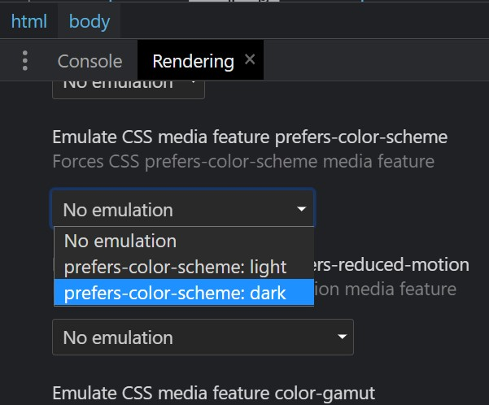

<!-- Home/ Presentación -->
<h1 align="center">📚 Calculadora 📊</h1>
<h3 align="center"> ⚡ <a href="https://igorcbraz.github.io/Calculadora/" target="_blank">Calculadora</a> Responsiva y con opciones de cambio de tema ⚡</h3>

<!-- Imágenes del Proyecto -->
<div align="center">
 <br>
<!-- Atribuciones-->
Desafío creado por <a href="https://www.frontendmentor.io/challenges/calculator-app-9lteq5N29"><em>Frontend Mentor</em></a>
</div>

<hr></hr>    
    
<h2 align="left">🌗  Preferencia de Esquema de Color:</h2>
<p>Además de los 3 diferentes temas de la calculadora, se utilizó la característica de medios<a href="https://developer.mozilla.org/en-US/docs/Web/CSS/@media/prefers-color-scheme" target="_blank"><code>prefer-color-scheme</code></a>.</p>

<p>Esta característica permite determinar la preferencia del usuario en cuanto a los temas, por lo que se pueden recibir dos valores:</p>

<ul>
<li>Light (Claro)</li>
<li>Dark (Oscuro)</li>
</ul>

<p>La forma de aplicar esta característica según la documentación de developer.mozilla es la siguiente:</p>

```
@media (prefers-color-scheme: dark) {
  // Configuraciones CSS para el tema oscuro
}

@media (prefers-color-scheme: light) {
  // Configuraciones CSS para el tema claro
}
```
<p>Pero con este método, la carga del código sería más lenta, ya que se requeriría repetir todas las propiedades deseadas con sus nuevas coloraciones.</p>
<h3>Entonces, ¿cuál es la solución?  🤔</h3>
<p>Solo vamos a cambiar los valores de las variables CSS con JS.</p>

```
const darkThemeMq  = window.matchMedia("(prefers-color-scheme: dark)");
const lightThemeMq = window.matchMedia("(prefers-color-scheme: light)");
```
<p>Primero identificamos la preferencia de tema del usuario y almacenamos el resultado en una constante.</p>
<p>Ahora solo necesitamos verificar el valor de las constantes y modificar los valores de las variables CSS.</p>

```
if (darkThemeMq.matches) {
    document.getElementById('btnTheme').value = "3";
    theme.dark();
} else if(lightThemeMq.matches){
    document.getElementById('btnTheme').value = "2";
    theme.light();    
} else {
    document.getElementById('btnTheme').value = "1";
    theme.defaul();    
}
```
<p>theme.dark(),theme.light()... Almacenan los comandos para modificar los valores de las variables en CSS. Estos son:</p>

```
const theme = {
    defaul(){
        root.style.setProperty('--background'          , '#3a4764');
        // Y las demás variables
    },
    light(){
        root.style.setProperty('--background'          , '#e6e6e6');
        // Y las demás variables
    },
    dark(){
        root.style.setProperty('--background'          , '#17062a');
        // Y las demás variables
    }
}

// Obtén el elemento raíz
var root = document.querySelector(':root');
```

<h3>¿Cómo es posible hacer la prueba/debug? 🤔</h3>
</p>Podemos usar la herramienta de desarrollador de Google Chrome y cambiar los valores a Dark o Light</p>


<div align="left">

<h3>Resultado Final 🥳:</h3>


    
<!-- Tecnologias e Frameworks Usados-->
<h2 align="left">🧠  Tecnologías y Frameworks Usados:</h2>

   
